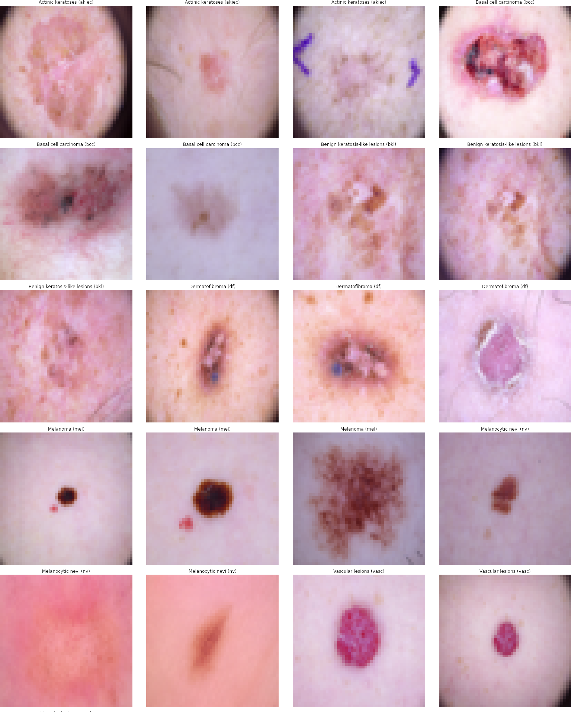
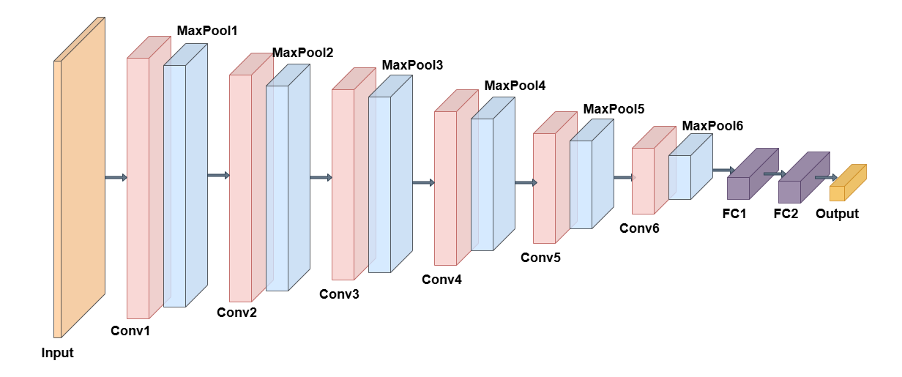
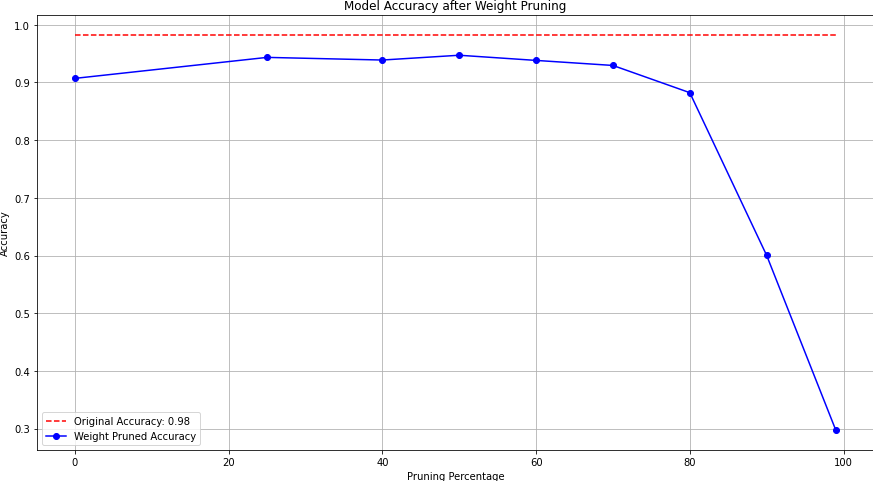
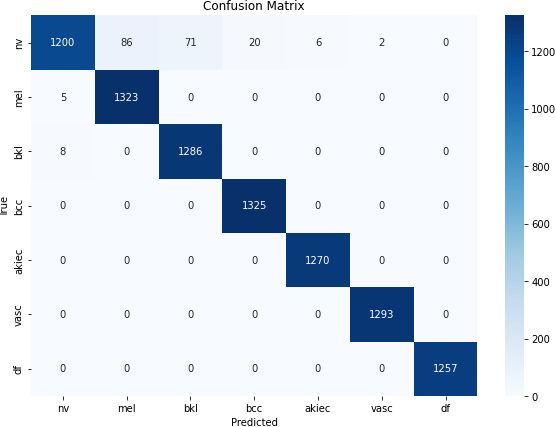

# 🩺 A Lightweight Pruned DCNN Model with XAI for Skin Cancer Classification 

## 📌 Overview  
Skin cancer is one of the most aggressive cancers, where early detection can drastically improve survival rates.  
This project presents a **lightweight pruned Deep Convolutional Neural Network (DCNN)** for **skin cancer classification** using the **HAM10000 dataset**.
Our model achieves **98.07% accuracy** while being **lightweight, fast, and deployment-ready** for real-world medical applications.

## 📂 Dataset  
We used the **HAM10000 dataset (10,015 dermatoscopic images)** containing 7 classes:  
- **NV** – Melanocytic nevi  
- **MEL** – Melanoma  
- **BKL** – Benign keratosis-like lesions  
- **BCC** – Basal cell carcinoma  
- **AKIEC** – Actinic keratoses / intraepithelial carcinoma  
- **VASC** – Vascular lesions  
- **DF** – Dermatofibroma

## 🔎 samples

## 🛠️ Tech Stack  
- **Language**: Python  
- **Frameworks**: TensorFlow, Keras  
- **Models**: Custom CNN + Pre-trained CNNs (VGG, ResNet, MobileNet, DenseNet, Inception, Xception, EfficientNet)  
- **Techniques**: Data Augmentation, Weight Pruning, Grad-CAM++

## 🔎 Model Architecture

## ⚡ Key Features  
- ✅ **Custom Deep CNN** with 6 convolutional layers  
- ✅ **50% Weight Pruning** → reduces size from **1.31 MB → 0.45 MB**  
- ✅ **Balanced & Augmented Dataset** for fair training  
- ✅ **Compared with 11 Pre-trained Models** (VGG16, ResNet50, MobileNetV2, etc.)  
- ✅ **Explainable AI (Grad-CAM++)** to highlight decision-making regions  
- ✅ **Fast Inference**: ~0.039s per image  
- ✅ **Deployment-friendly** for mobile/embedded devices

## 🎯 Prunning Method

## 📊 Results

| Model                  | Accuracy (%) | Precision | Recall | F1 Score | Size (MB) | Inference Time (s) |
|------------------------|-------------|-----------|--------|----------|-----------|---------------------|
| VGG16                  | 88.84       | 88.38     | 88.48  | 88.47    | 75.77     | 0.4612             |
| ResNet50               | 88.66       | 88.25     | 88.66  | 88.11    | 96.61     | 1.0181             |
| MobileNetV2            | 83.59       | 82.58     | 83.59  | 82.61    | 12.75     | 0.7848             |
| **Our DCNN**           | **98.25**   | **98.29** | **98.25** | **98.23** |**1.31**|**0.0428**         |
| **Pruned DCNN (Ours)** | **98.07**   | **98.15** | **98.07** | **98.02** |**0.45**|**0.0395**         |

## 🎯 Confusion Matrix

